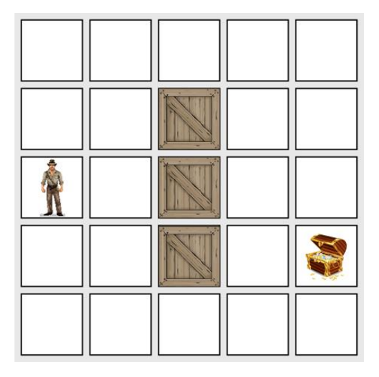

# **Busca do Primeiro Melhor - Inteligência Artificial (IA)**

>Professor: *Andre Luiz Brun*

>Colaboradores: *Gabriel Mazzuco* ([Github Profile](https://github.com/gabrielmazz)), *Rodrigo Rocha* ([Github Profile](https://github.com/Rodrigo2603)) e *Guilherme Correia* ([Github Profile](https://github.com/Guilok11))

---

## **Conteúdo:**

O programa consiste em criar um algoritmo de Inteligência Artificial usando o método da Busca pelo Primeiro Melhor ou Best-First Search (BFS)

- Linguagem utilizado: *Python*

<br>

### *Peculiaridades do método:*
- O método A* é derivado deste
- Parecido com a Subida da Encosta
- Considera todas as informações disponíveis até aquele instante, não apenas as da última expansão

## **Pseudocódigo**

```python
fila <-- []         #Inicializa uma fila vazia
estado <-- no raiz  #Inicializa o estado inicial

while(true)
    if(eh_objetivo(estado)):
        return SUCESSO
    else:
        insere_na_frente_da_fila(sucessores(estado))
        ordena(fila)
    
    if(fila == []):
        return FALHA

    # O novo estado é o primeiro item da fila
    estado <-- fila[0]  
    remover_primeiro_item_da(fila)

```

## **Objetivo:**

- *Estado Inicial:* um grid bidimensional de entrada pré-definido contendo as posições que podem ser percorridas e aquelas que são proibidas no caso o void. Além disso, deve-se informar a posição do ponto de partida e o ponto de destino

- Cada posição do grid deve-se adotar uma estimativa de distância até a posição final, no caso aqui é usado pitágoras para conseguir uma outra matriz com os valores

- 

<br>

## **Execução:**

- Para executar o código, basta executar o comando: 

    ```shell
    python3 main.py
    ```

### *Extras:*

- Para dar algum contexto ao programa, é utilizado a história de One Piece apenas para um background sendo o tesouro o próprio One Piece, o personagem sendo o Luffy, e as caixas os návios. Todo o resto do grid é o mar